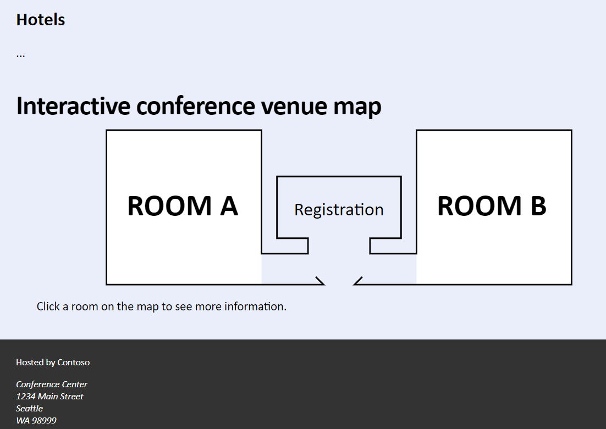
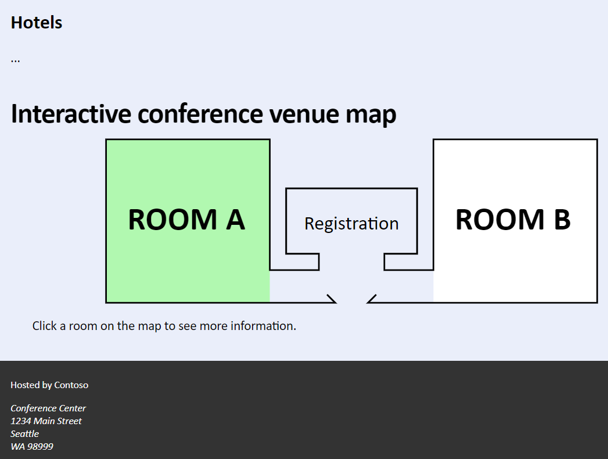
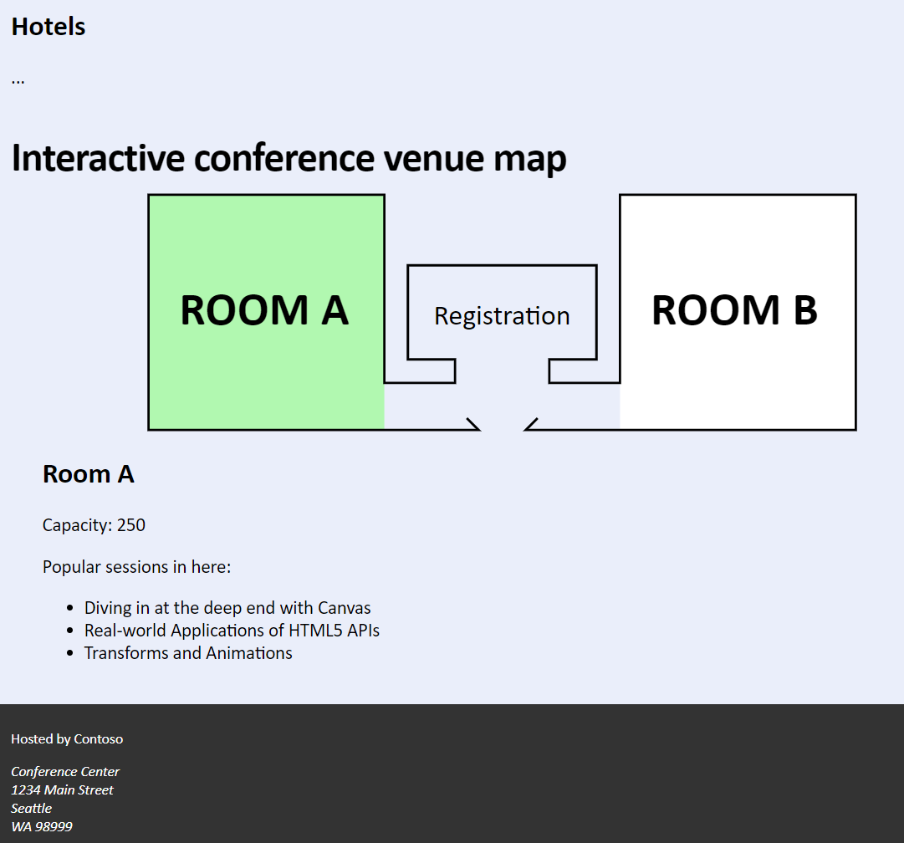

# Laboratorio Módulo 11: Creating Advanced Graphics
## Exercise 1: Creating an Interactive Venue Map by Using SVG
### Nombres y apellidos:
Miguel Ángel Cabrero Luengo
### Fecha:
13/10/2020
### Resumen del Ejercicio:

#### Objetivo del ejercicio:
Dado un mapa de unas ubicaciones, el objetivo es destacar una zona cambiando su color de fondo y si el usuario la seleccionar proporcionar información de la misma.

Se combina el dibujo de figuras con SVG, interactividad mediante CSS y código jscript.

#### Tareas realizadas:

- Mediante la etiqueta SVG se dibujan dos áreas asignandoles identificadores únicos s sus contenedores.

- A cada uno de us contenedores se les aplica mediante CSS el evento hover de forma que al pasar por encima cambie de color.

- Se añade el evento click a las imágenes para actualizar la información de cada área del edificio.

Resultados de ejecución:

#### Pantalla location inicial:

#### Pantalla location al pasar el ratón por encima:

#### Pantalla location al pulsar sobre alguna de las imágenes:

### Dificultad o problemas presentados y cómo se resolvieron:
No ha presentado problemas.

Puede probarse con los siguientes enlaces:

- Página <a href="location.htm" target="_blank">location</a>.