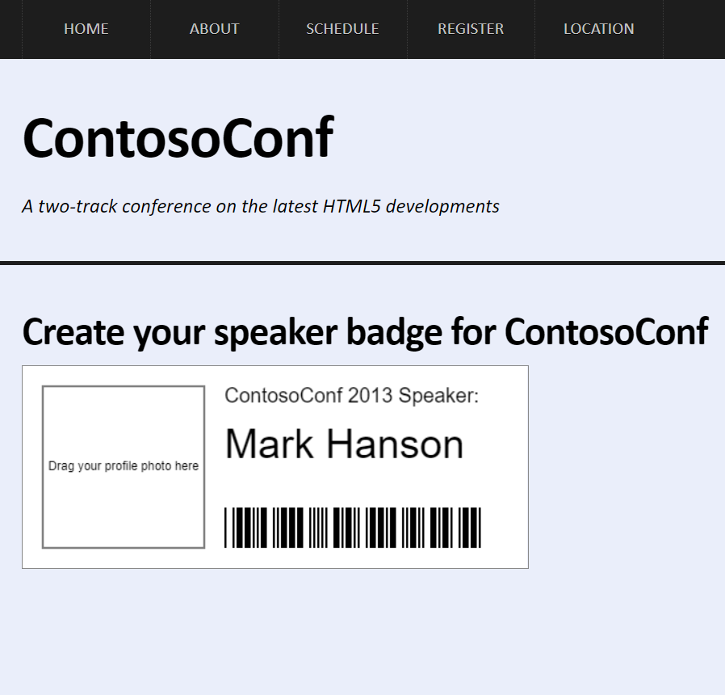
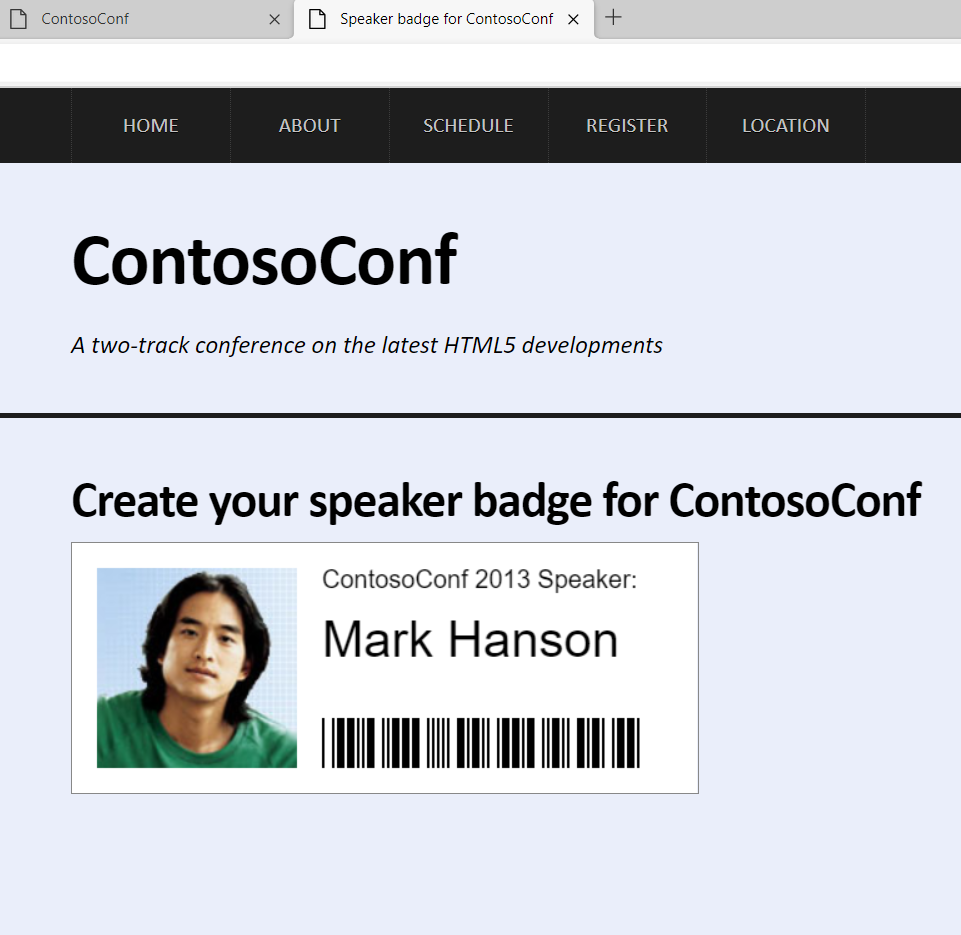

# Laboratorio Módulo 11: Creating Advanced Graphics
## Exercise 2: Creating a Speaker Badge by Using the Canvas API
### Nombres y apellidos:
Miguel Ángel Cabrero Luengo
### Fecha:
13/10/2020
### Resumen del Ejercicio:

#### Objetivo del ejercicio:
Pintar una ficha mediante canvas donde mostrar información de un conferenciante.

#### Tareas realizadas:

- Se añaden las líneas para pintar mediante4 canvas la ficha del conferenciante.

- sE HABILITA UNA ZONA PARA PINTAR UNA IMAGEN QUE SE SUELA SOBRE LA PROPIA PÁGINA HTML.
Resultados de ejecución:

#### Pantalla speaker-badge:
Pantalla sin la foto.

#### Pantalla speaker-badge:
Pantalla una vez arrastrada la foto.

### Dificultad o problemas presentados y cómo se resolvieron:
No ha presentado problemas.

Puede probarse con los siguientes enlaces:

- Página <a href="speaker-badge.htm" target="_blank">speaker-badge</a>.