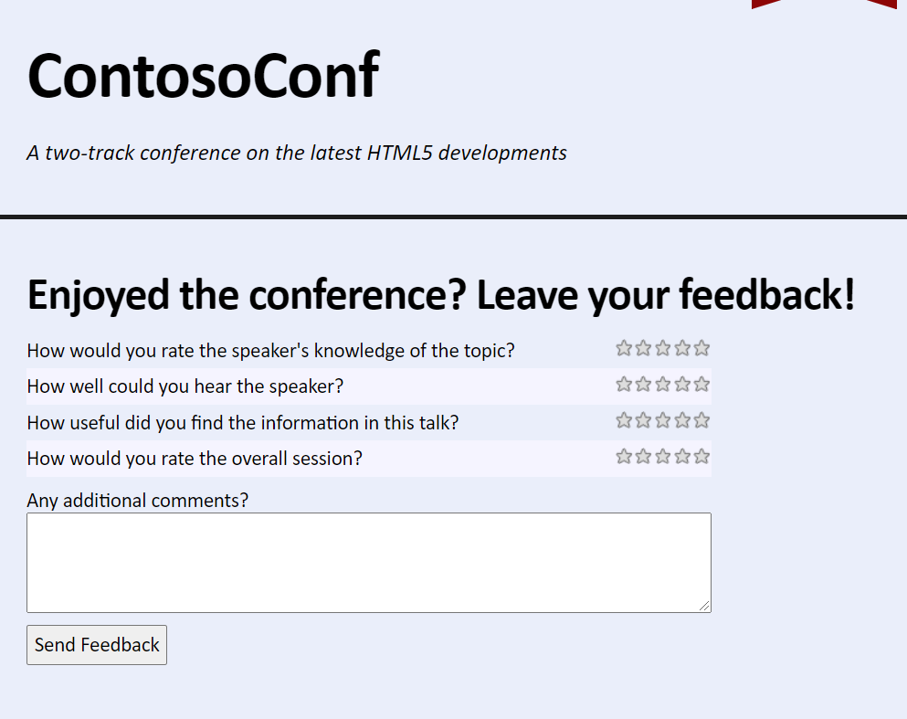
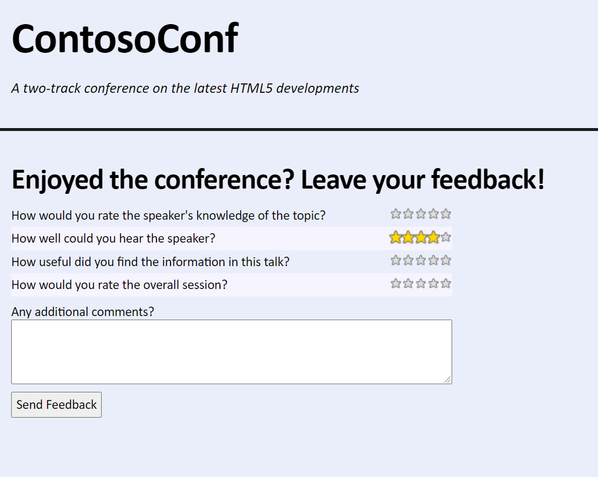

# Laboratorio Módulo 12: Animating the User Interface
## Exercise 1: Applying CSS Transitions
### Nombres y apellidos:
Miguel Ángel Cabrero Luengo
### Fecha:
13/10/2020
### Resumen del Ejercicio:

#### Objetivo del ejercicio:
Aplicar una animación en la valoración de una conferencia. Cuando el usuario pase el ratón por ecnima de una estrella, esta aumenta de tamaño.

#### Tareas realizadas:

Se añade un fichero css y js para añadir una animación y grabar la valoración del usuario.

Resultados de ejecución:

#### Pantalla feedback:
Antes de seleccionar una valoración:

#### Pantalla feedback:
Después de seleccionar una valoración:

### Dificultad o problemas presentados y cómo se resolvieron:
No ha presentado problemas.

Puede probarse con los siguientes enlaces:

- Página <a href="feedback.htm" target="_blank">feedback</a>.