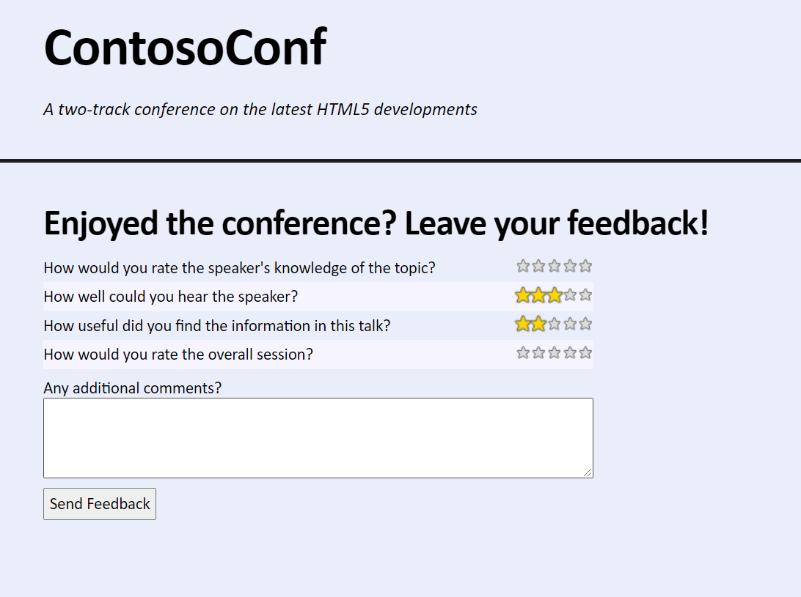
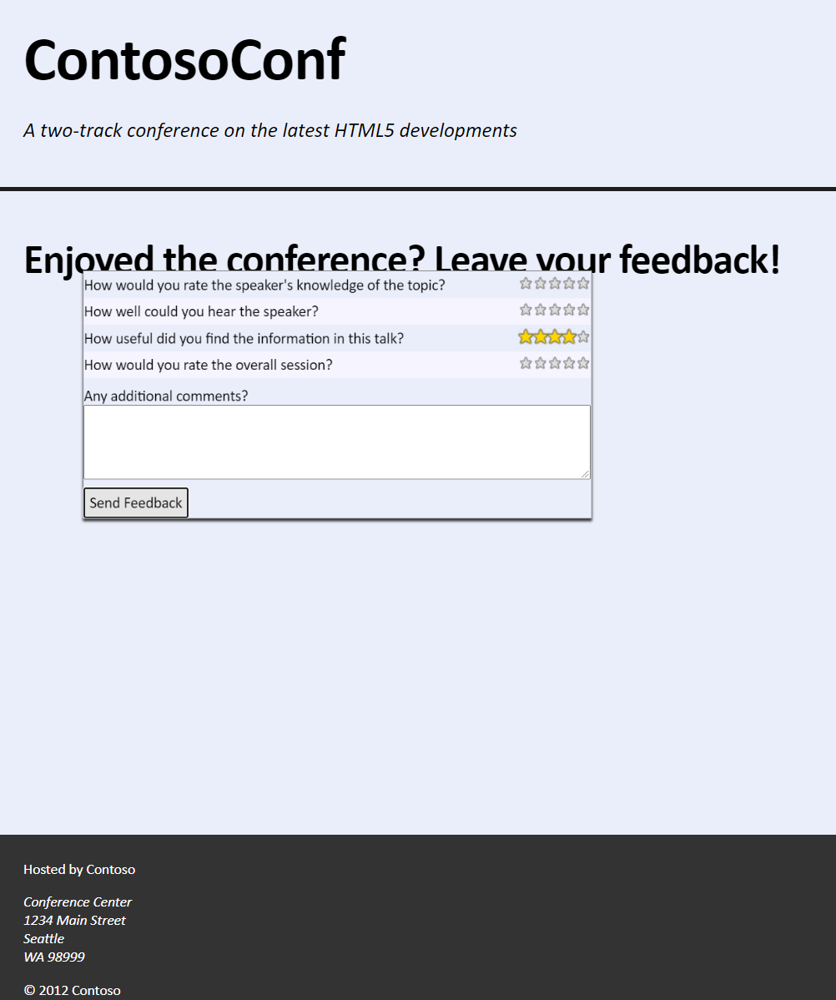
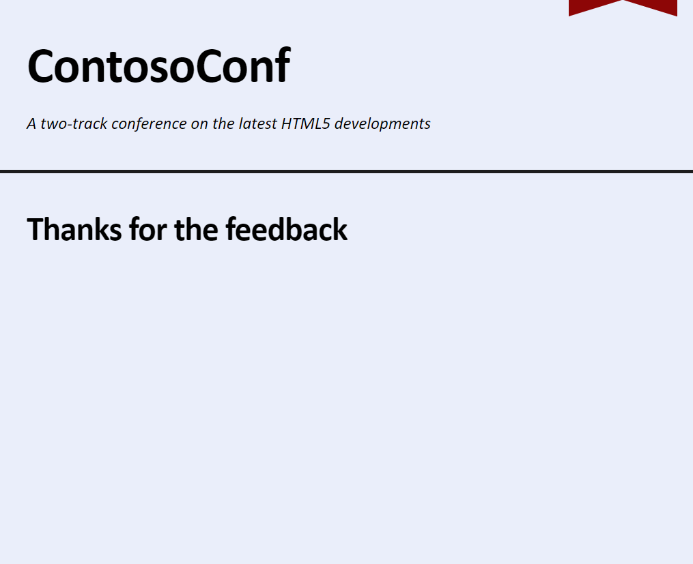

# Laboratorio Módulo 12: Animating the User Interface
## Exercise 2: Applying Keyframe Animations
### Nombres y apellidos:
Miguel Ángel Cabrero Luengo
### Fecha:
13/10/2020
### Resumen del Ejercicio:

#### Objetivo del ejercicio:
Añadir una animación en el proceso de pulsar sobre la confirmación de valoración de una conferencia

#### Tareas realizadas:

Se actualiza el fichero feedback.css con la animación diseñada.

En el ficehro feedback.js se añade de forma dinámica la clase creada al formulario de la valoración.

Resultados de ejecución:

#### Pantalla feedback inicial:

#### Pantalla feedback tras enviar el formulario:

#### Pantalla feedback final:

### Dificultad o problemas presentados y cómo se resolvieron:
No ha presentado problemas.

Puede probarse con los siguientes enlaces:

- Página <a href="feedback.htm" target="_blank">feedback</a>.