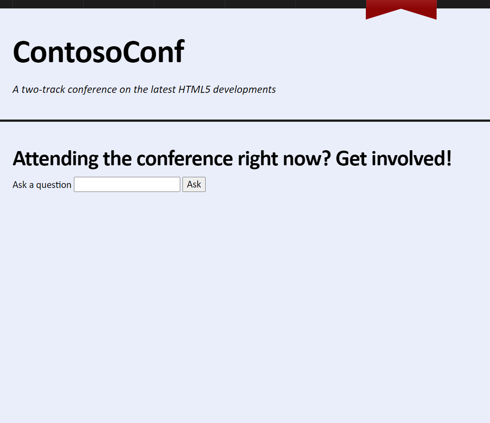
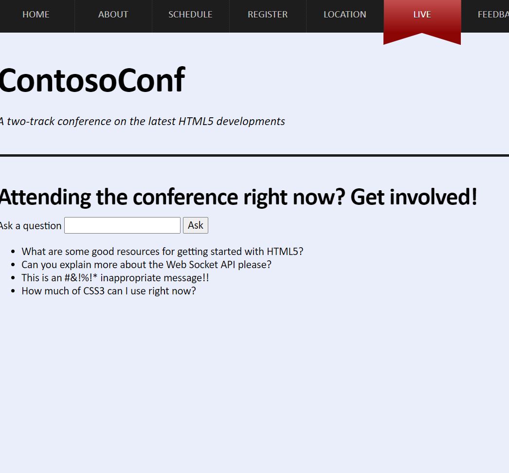

# Laboratorio Módulo 13: Implementing Real-time Communication by Using Web Sockets
## Exercise 1: Receiving Messages from a Web Socket
### Nombres y apellidos:
Miguel Ángel Cabrero Luengo
### Fecha:
13/10/2020
### Resumen del Ejercicio:

#### Objetivo del ejercicio:
Recibir respuestas a partir de los envíos realizados a través de websocket.

#### Tareas realizadas:

En el código js, se añade una instancia al objeto WebSocket

Resultados de ejecución:

#### Pantalla live al abrirse:

#### Pantalla live tras unos segundos y recibir las notificaciones:

### Dificultad o problemas presentados y cómo se resolvieron:
No ha presentado problemas.

Puede probarse con los siguientes enlaces:

- Página <a href="live.htm" target="_blank">live</a>.