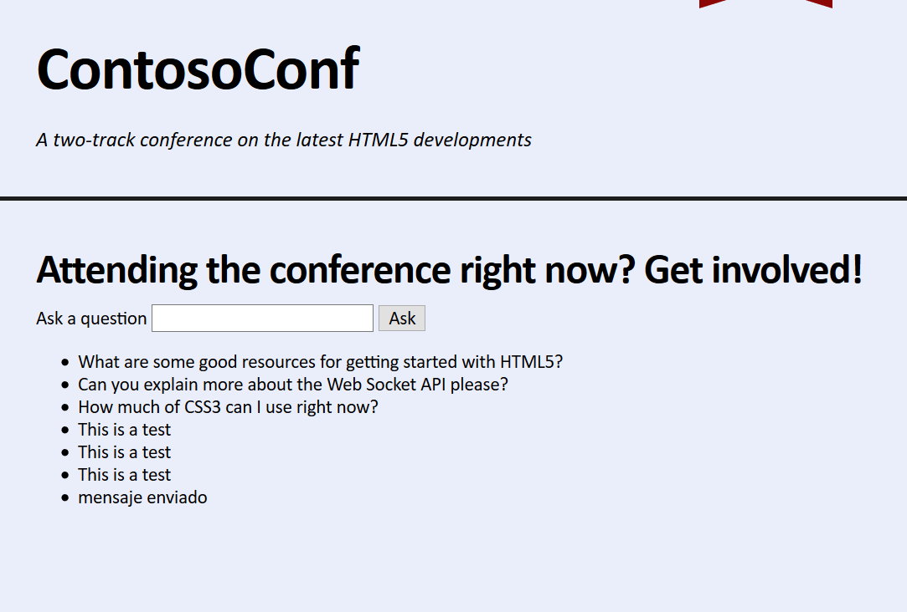

# Laboratorio Módulo 13: Implementing Real-time Communication by Using Web Sockets
## Exercise 2: Sending Messages to a Web Socket
### Nombres y apellidos:
Miguel Ángel Cabrero Luengo
### Fecha:
13/10/2020
### Resumen del Ejercicio:

#### Objetivo del ejercicio:
Permite enviar y mostrar un mensaje a través de websocket

#### Tareas realizadas:

Se modifica el fichero  LivePage.js incluyendo código para escuchar mensajes y mostrarlos por pantalla.

Resultados de ejecución:

#### Pantalla live:
Pantalla que muestra la opción de escribir mensaje y pasado un tiempo se muestra dicho mensaje.

### Dificultad o problemas presentados y cómo se resolvieron:
No ha presentado problemas.

Puede probarse con los siguientes enlaces:

- Página <a href="live.htm" target="_blank">live</a>.