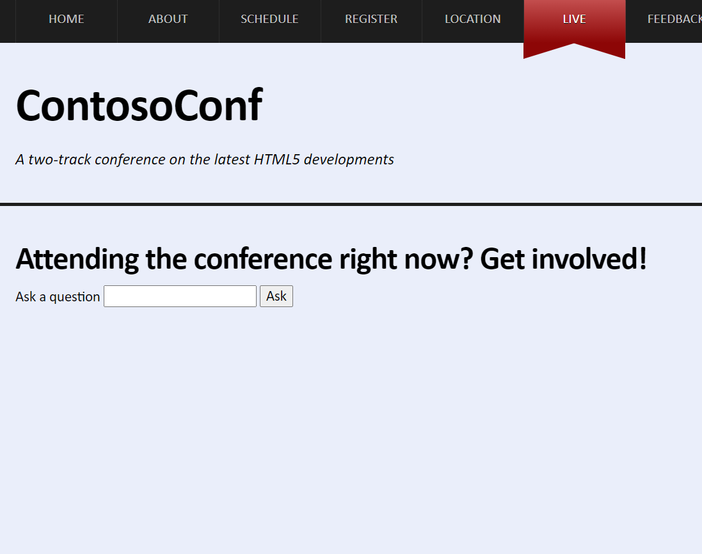
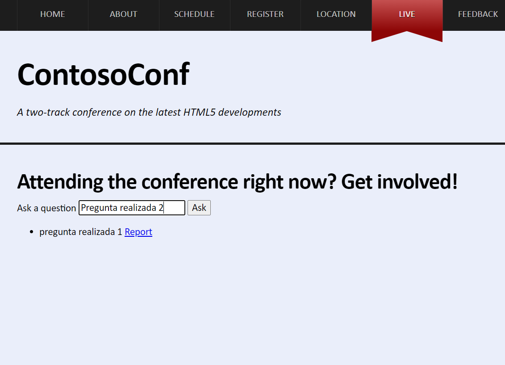
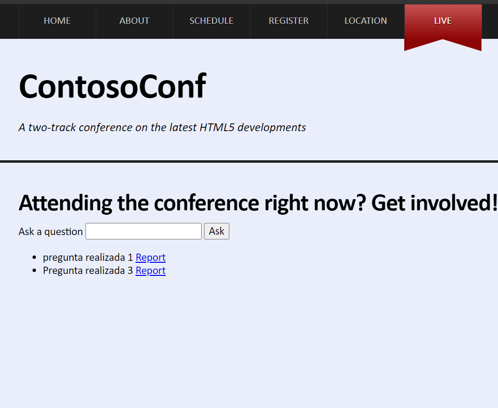

# Laboratorio Módulo # 13: Implementing Real-time Communication by Using Web Sockets
## Exercise 3: Handling Different Web Socket Message Types
### Nombres y apellidos:
Miguel Ángel Cabrero Luengo
### Fecha:
13/10/2020
### Resumen del Ejercicio:

#### Objetivo del ejercicio:

Realizar una página donde se puedan enviar comentarios, se muestren y una vez revisados puedan eliminarse.

#### Tareas realizadas:

Se añade código necesario para:

- Mostrar mensajes recibidos

- Enviar mensaje introducido.

- Eliminar mensajes

Resultados de ejecución:

#### Pantalla live al inicio:

#### Pantalla live al enviar mensajes:

#### Pantalla live al eliminar mensajes (pulsando Report):

### Dificultad o problemas presentados y cómo se resolvieron:
No ha presentado problemas.

Puede probarse con los siguientes enlaces:

- Página <a href="live.htm" target="_blank">live</a>.