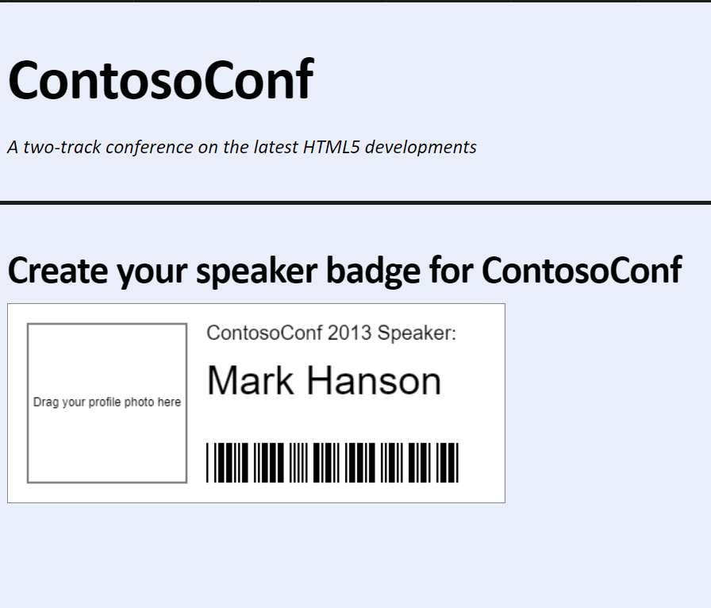
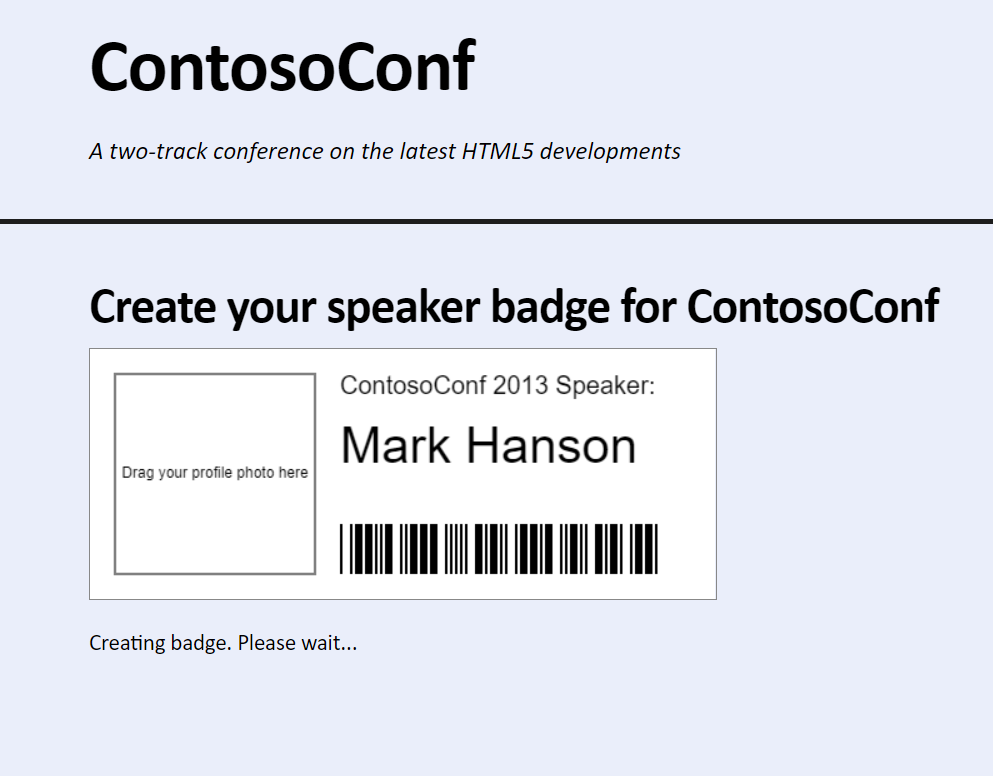
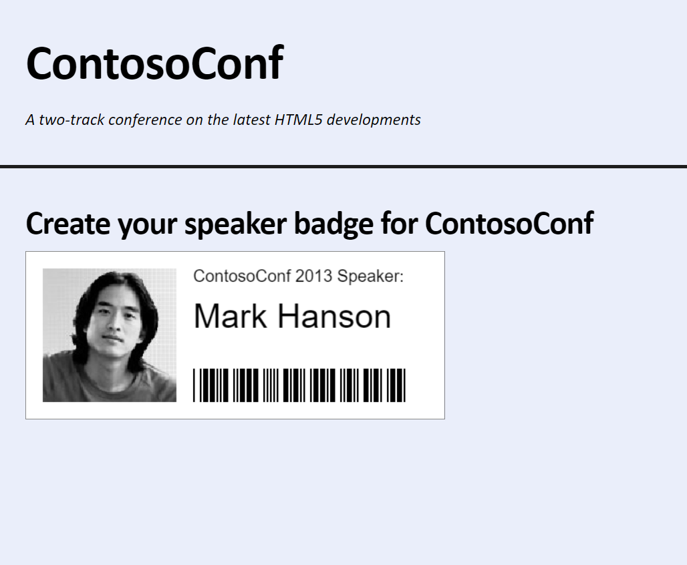

# Laboratorio Módulo 14: Performing Background Processing by Using Web Workers
## Exercise 1: Improving Responsiveness by Using a Web Worker
### Nombres y apellidos:
Miguel Ángel Cabrero Luengo
### Fecha:
13/10/2020
### Resumen del Ejercicio:

#### Objetivo del ejercicio:
Permite arrastrar una imagen sobre una tarjeta con datos de un conferenciante.

Una vez que la imagen es recibida se convierte a blanco y negro.

El proceso de carga de la imagen  se realiza de forma asincrona y no bloquea el navegador.

#### Tareas realizadas:

En el fichero grayscale.js se utiliza un objeto canvas para recepcionar la foto y convertirla en blanco y negro.

Resultados de ejecución:

#### Pantalla speaker-badge inicial:

#### Pantalla speaker-badge durante el proceso de carga:

#### Pantalla speaker-badge tras el proceso de carga:

### Dificultad o problemas presentados y cómo se resolvieron:
No ha presentado problemas.

Puede probarse con los siguientes enlaces:

- Página <a href="speaker-badge.htm" target="_blank">speaker-badge</a>.