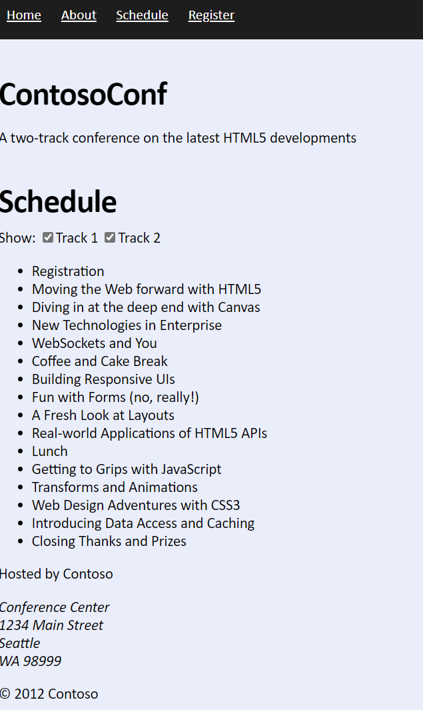
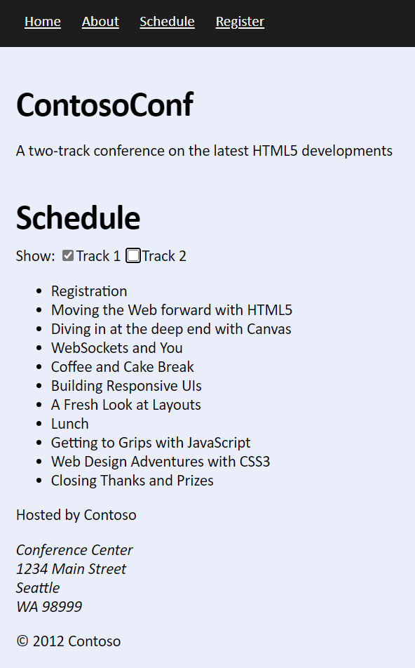
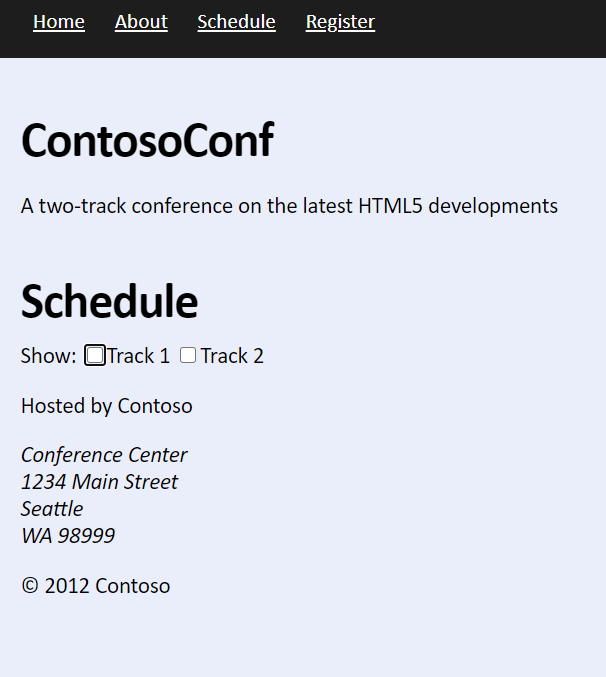
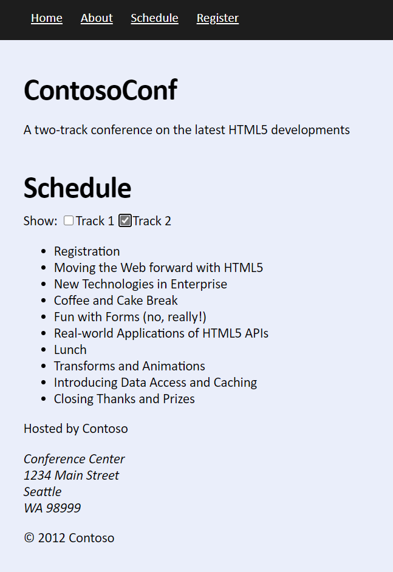

# Laboratorio Módulo 2
## Exercise 2: Handling Events
### Nombres y apellidos:
Miguel Ángel Caberero Luengo
### Fecha:
13/10/2020
### Resumen del Ejercicio:
El objetivo del ejercicio es a partir de una lista de contenidos introducidos de forma estática en el código, obtener y mostrar dichos datos.

Los datos se obtienen al gestionar los eventos de pulsar sobre nuevos objetos tipo check añadidos en la página schedule.htm

Al seleccionar la página Schedule, se mostrarán todos los eventos disponibles por defecto. A continuación se muestran las diferentes opciones de uso de la página:

#### Apertura de la página shedule y datos mostrados por defecto:

#### Apertura de la página shedule y datos mostrados al seleccionar solo el track 1:

#### Apertura de la página shedule y datos mostrados al no seleccionar ningún track:

#### Apertura de la página shedule y datos mostrados al seleccionar solo el track 2:

### Dificultad o problemas presentados y cómo se resolvieron:
No ha tenido dificultad ya que es una página muy básica y se guía paso a paso los cambios a realizar..

Puede probarse con los siguientes enlaces:

- Página <a href="schedule.htm" target="_blank">schedule</a>.