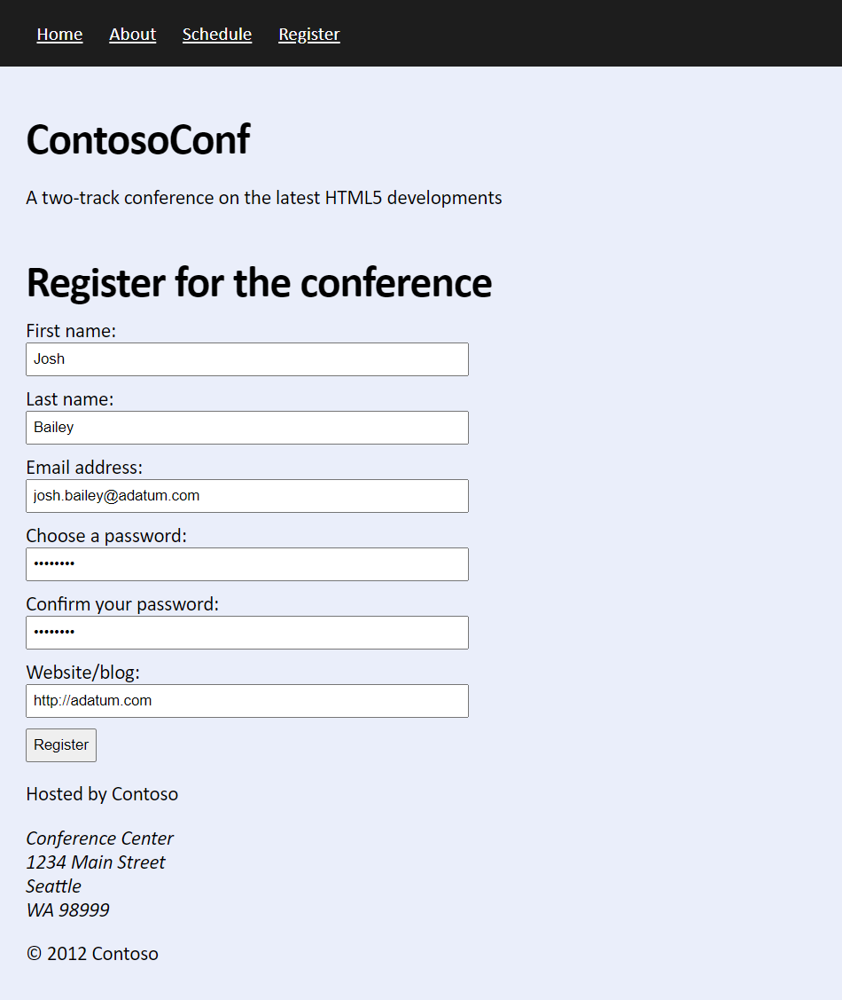
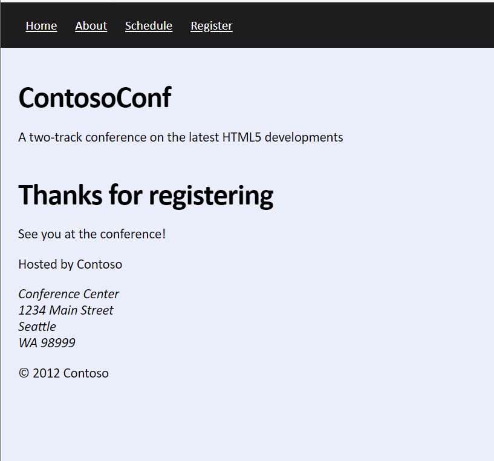
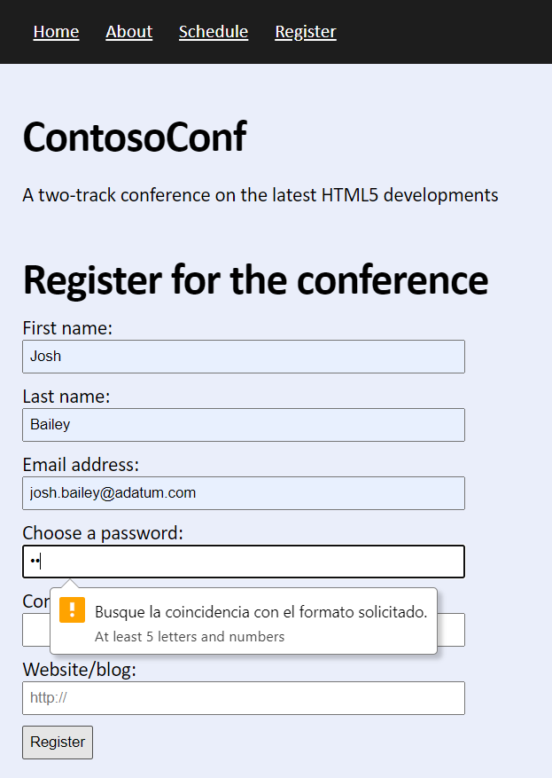

# Laboratorio Módulo 4
## Exercise 1: Creating a Form and Validating User Input by Using HTML5 Attributes
### Nombres y apellidos:
Miguel Ángel Caberero Luengo
### Fecha:
13/10/2020
### Resumen del Ejercicio:
Añadir etiquetas html5 de formulario en la página de registro.

Introducir valores en los campos añadidos anteriormente.

Mostrar mensaje de confirmación de registro.

Incluir validaciones básicas a partir de las etiquetas HTML5, como campos obligatorios, complejidad de contraseña etc.

Resultados de ejecución:

#### Apertura formulario de registro:

#### Confirmación de registro correcto:

#### Validaciones básicas:

### Dificultad o problemas presentados y cómo se resolvieron:
No ha presentado problemas.

Puede probarse con los siguientes enlaces:

- Página <a href="register.htm" target="_blank">register</a>.