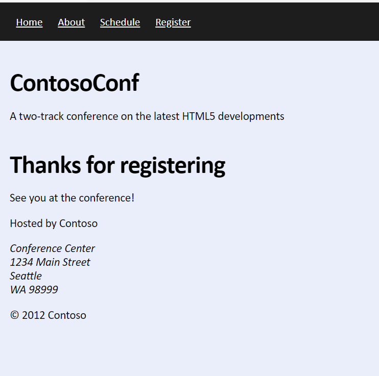

# Laboratorio Módulo 4
## Exercise 2: Validating User Input by Using JavaScript
### Nombres y apellidos:
Miguel Ángel Caberero Luengo
### Fecha:
13/10/2020
### Resumen del Ejercicio:

Incluir validaciones básicas a partir de código jscript, como igualdad de contraseña y su confirmación.

Se añade formato para destacar los campos obligatorios y vacíos.

Resultados de ejecución:

#### Validación jscript de dirección de correo:

#### Validación jscript coincidencia contraseñas:

#### Confirmación registro correcto:

#### Formato destacado campos obligatorios vacíos:

### Dificultad o problemas presentados y cómo se resolvieron:
No ha presentado problemas.

Puede probarse con los siguientes enlaces:

- Página <a href="register.htm" target="_blank">register</a>.