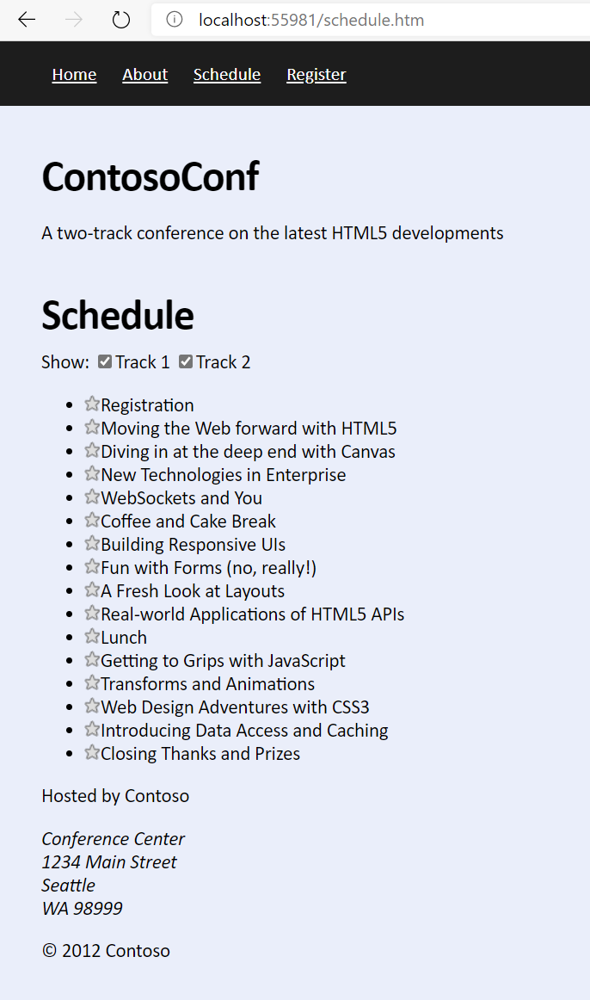
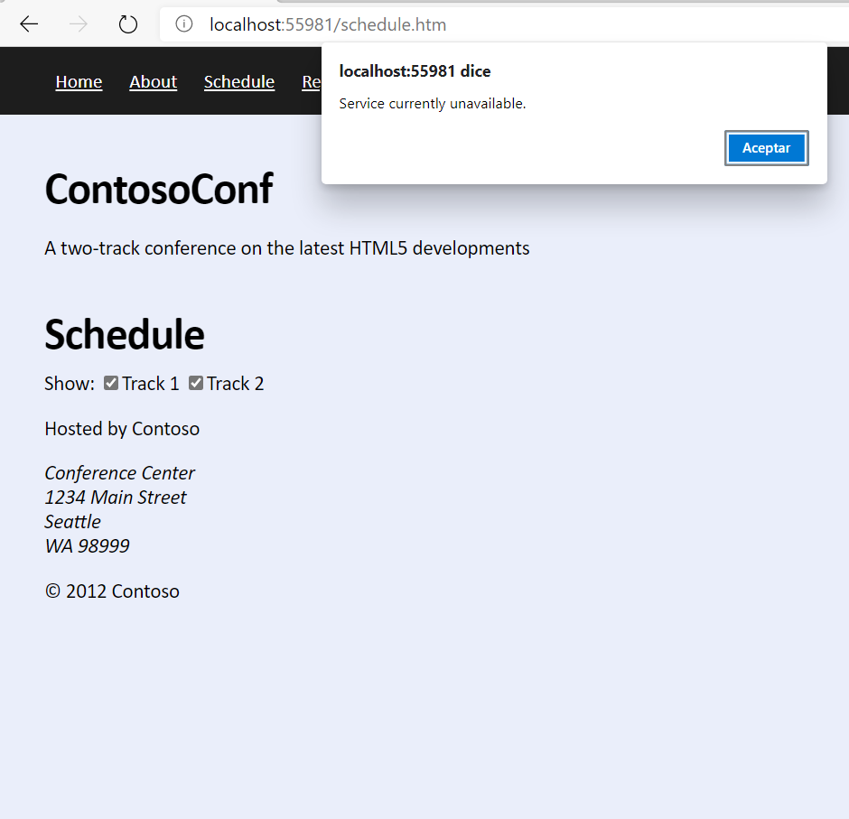

# Laboratorio Módulo 5: Communicating with a Remote Server
## Exercise 1: Retrieving Data
### Nombres y apellidos:
Miguel Ángel Cabrero Luengo
### Fecha:
13/10/2020
### Resumen del Ejercicio:

Los datos se cargan al llamar a un servicio. 

Se realizan dos validaciones:

- El servicio devuelve bien los datos 
- El servicio devuelve mal los datos al enviarle una consulta errónea.

Para el segundo caso se cambia la llamada al servicio desde el archivo jscript.

Resultados de ejecución:

#### Obtención correcta de contenidos:

#### Obtención errónea de contenidos:

### Dificultad o problemas presentados y cómo se resolvieron:
No ha presentado problemas.

Puede probarse con los siguientes enlaces:

- Página <a href="schedule.htm" target="_blank">schedule</a>.