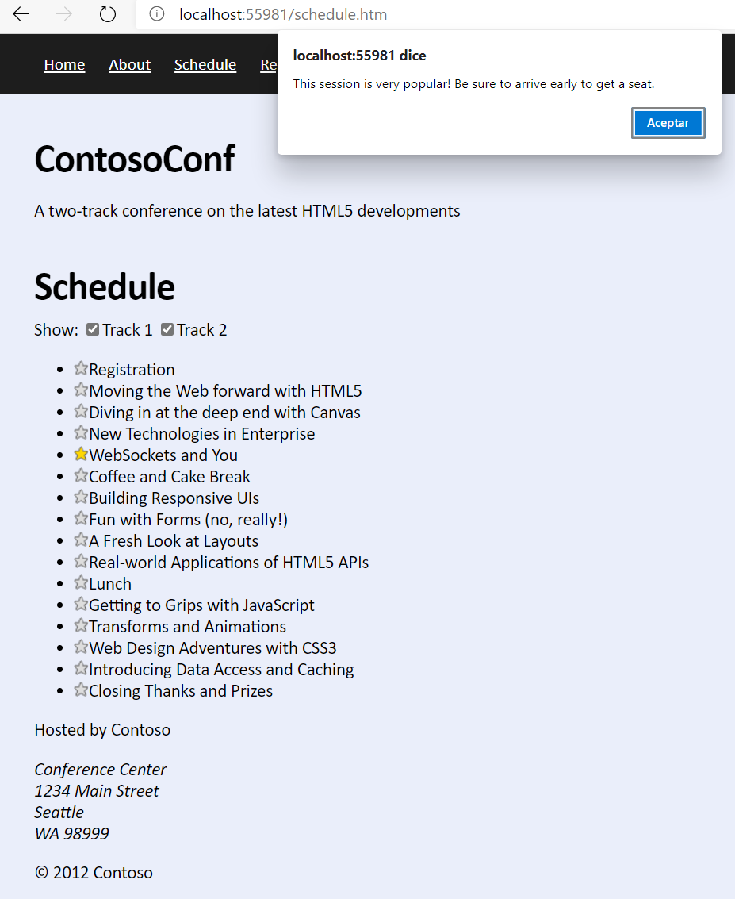

# Laboratorio Módulo 5: Communicating with a Remote Server
## Exercise 2: Serializing and Transmitting Data
### Nombres y apellidos:
Miguel Ángel Cabrero Luengo
### Fecha:
13/10/2020
### Resumen del Ejercicio:

Llamar a un servicio en respuesta a un evento.

Identificar el valor de respuesta del evento de forma síncrona y mostrar un mensaje de recepción correcta de datos.

Resultados de ejecución:

#### Obtención correcta de contenidos:

### Dificultad o problemas presentados y cómo se resolvieron:
No ha presentado problemas.

Puede probarse con los siguientes enlaces:

- Página <a href="schedule.htm" target="_blank">schedule</a>.