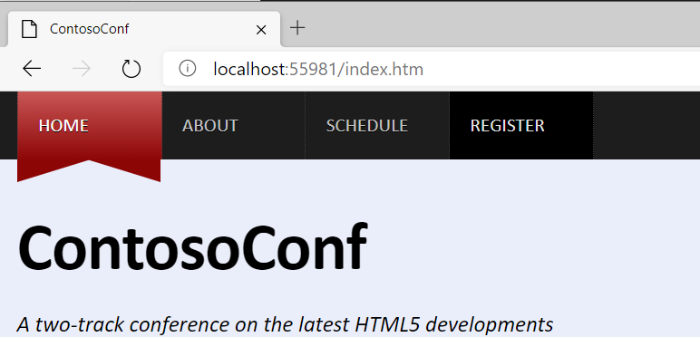
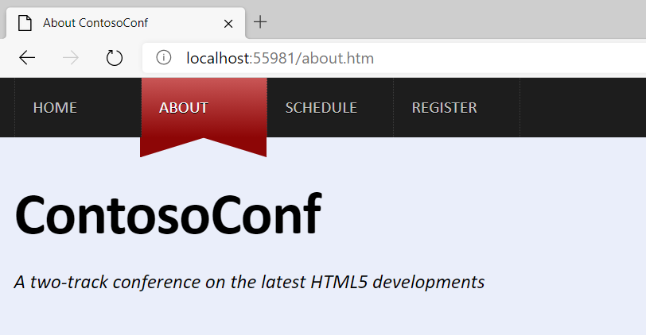
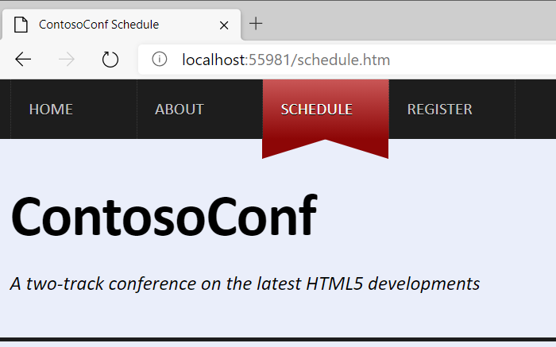
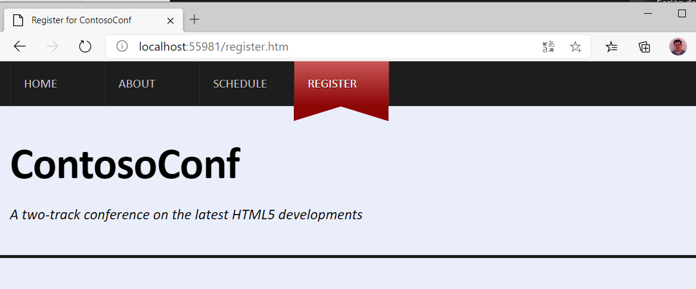

# Laboratorio Módulo Module 6: Styling HTML5 by Using CSS3
## Exercise 1: Styling the Navigation Bar
### Nombres y apellidos:
Miguel Ángel Cabrero Luengo
### Fecha:
13/10/2020
### Resumen del Ejercicio:

Aplicar estilos a diferentes elementos de HTML5 y en la barra de navegación.

Se han incluido etiquetas adicionales en los ficheros html para identificar los elementos que recibirán el nuevo formato.

Se han actualizado los contenidos de los ficheros de css

Resultados de ejecución:

#### Menu Home con el nuevo formato:

#### Menu About con el nuevo formato:

#### Menu Schedule con el nuevo formato:

#### Menu Register con el nuevo formato:

### Dificultad o problemas presentados y cómo se resolvieron:
No ha presentado problemas.

Puede probarse con los siguientes enlaces:

- Página <a href="schedule.htm" target="_blank">schedule</a>.