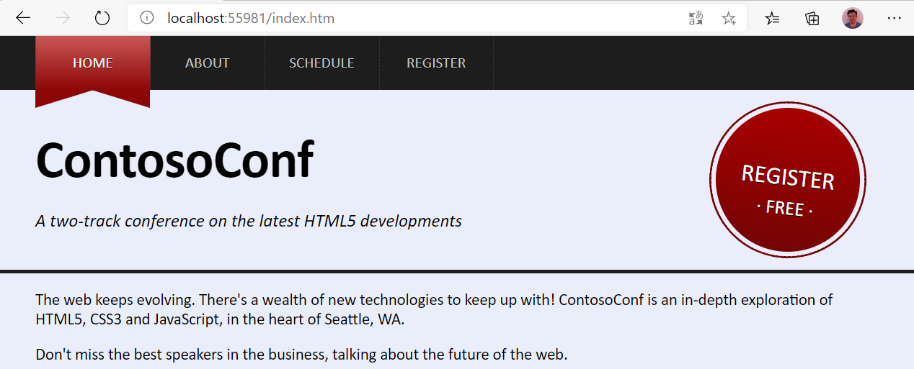

# Laboratorio Módulo Module 6: Styling HTML5 by Using CSS3
## Exercise 2: Styling the Register Link
### Nombres y apellidos:
Miguel Ángel Cabrero Luengo
### Fecha:
13/10/2020
### Resumen del Ejercicio:

#### Objetivo del ejercicio:
Aplicar estilo al enlace de texto dentro de la página Home.

#### Tareas realizadas:

Se han incluido etiquetas adicionales en el fichero home.htm para identificar el bloque del texto con el enlace del registro.

Se han actualizado los contenidos de los ficheros de css referentes al elemento a modificar

Resultados de ejecución:

#### Menu Home con el nuevo formato:

### Dificultad o problemas presentados y cómo se resolvieron:
No ha presentado problemas.

Puede probarse con los siguientes enlaces:

- Página <a href="home.htm" target="_blank">home</a>.