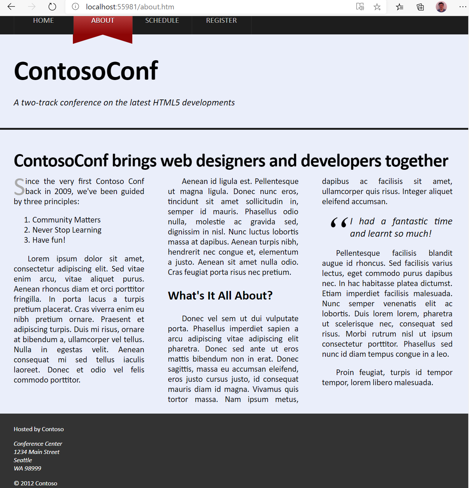

# Laboratorio Módulo Module 6: Styling HTML5 by Using CSS3
## Exercise 3: Styling the About Page
### Nombres y apellidos:
Miguel Ángel Cabrero Luengo
### Fecha:
13/10/2020
### Resumen del Ejercicio:

#### Objetivo del ejercicio:
Aplicar estilo a la página acerca de (about)

#### Tareas realizadas:

Se han incluido etiquetas y contenidos adicionales en el fichero about.htm.

Se han actualizado los contenidos de los ficheros de css referentes al elemento a modificar

El texto introducido en la página de about se ha distribuido en tres columnas.

Resultados de ejecución:

#### Menu About con el nuevo formato:

### Dificultad o problemas presentados y cómo se resolvieron:
No ha presentado problemas.

Puede probarse con los siguientes enlaces:

- Página <a href="about.htm" target="_blank">about</a>.