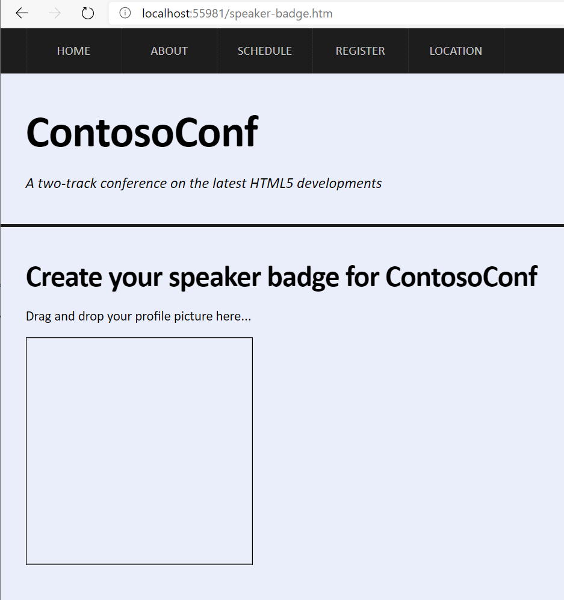

# Laboratorio Módulo 8: Creating Interactive Pages by Using HTML5 APIs
## Exercise 1: Dragging and Dropping Images
### Nombres y apellidos:
Miguel Ángel Cabrero Luengo
### Fecha:
13/10/2020
### Resumen del Ejercicio:

#### Objetivo del ejercicio:
Incorporar una página donde poder actualizar la foto de un usuario, arrastrando y soltando el fichero de una imagen.

#### Tareas realizadas:

En el fichero SpeakerBadgePage.js,

- Se añaden dos "escuchadores", uno que permita identificar si se está arrastrando encima de la página alguna imagen y otro que identifica si finalmente se ha soltado la imagen encima del control
 
Resultados de ejecución:

#### Pantalla arrastrar documento sin foto:

#### Pantalla arrastrado documento con foto:

### Dificultad o problemas presentados y cómo se resolvieron:
No ha presentado problemas.

Puede probarse con los siguientes enlaces:

- Página <a href="schedule.htm" target="_blank">schedule</a>.