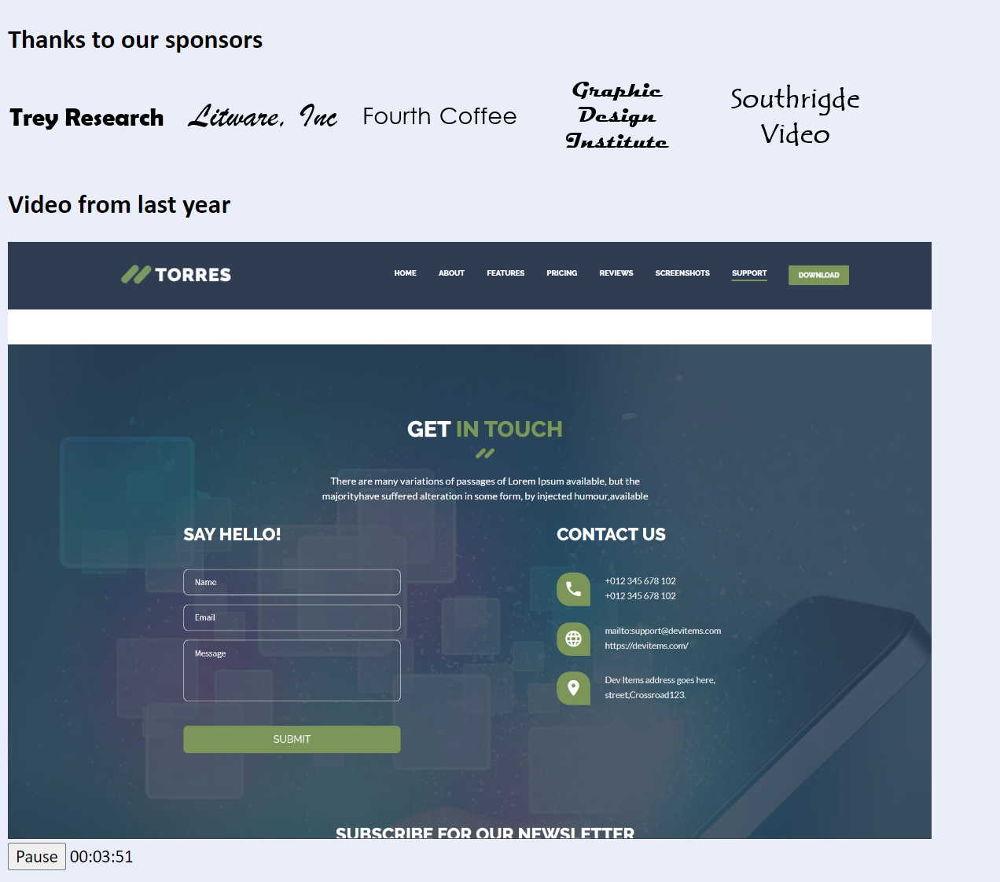

# Laboratorio Módulo 8: Creating Interactive Pages by Using HTML5 APIs
## Exercise 2: Incorporating Video
### Nombres y apellidos:
Miguel Ángel Cabrero Luengo
### Fecha:
13/10/2020
### Resumen del Ejercicio:

#### Objetivo del ejercicio:

Incorporar un reproductor de video en la página principal

#### Tareas realizadas:

- Se añade una etiqueta html5 para visualizar video en la página principal (home)

- En jscript se incorporan controles para manejar la reproducción del video, controlando el inicio de reproducción del video y la pausa.

Resultados de ejecución:

#### Pantalla Home sin reproducir el video (botón play):

#### Pantalla Home reproducciendo el video (botón pause):

### Dificultad o problemas presentados y cómo se resolvieron:
El video que venía de ejemplo no funcionaba ya que daba un conflicto de seguridad y se tuvo que cambiar a un fichero local.

Puede probarse con los siguientes enlaces:

- Página <a href="schedule.htm" target="_blank">schedule</a>.