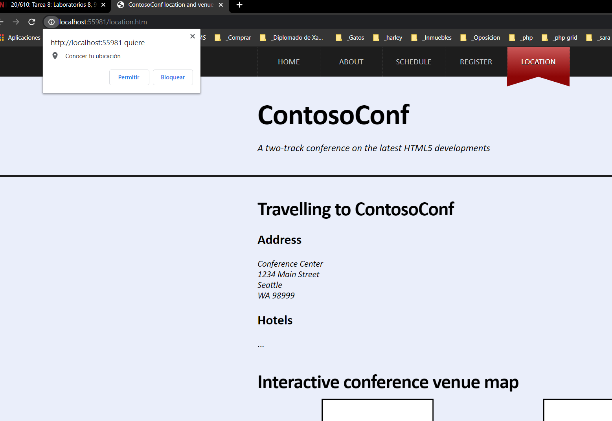
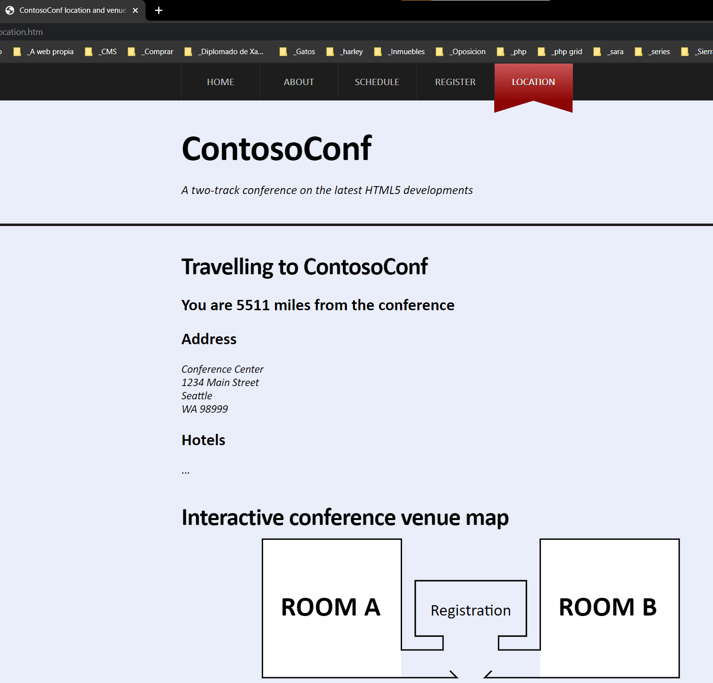

# Laboratorio Módulo 8: Creating Interactive Pages by Using HTML5 APIs
## Exercise 3: Using the Geolocation API to Report the User's Current Location
#### 
### Nombres y apellidos:
Miguel Ángel Cabrero Luengo
### Fecha:
13/10/2020
### Resumen del Ejercicio:

#### Objetivo del ejercicio:
Utilizar la geolocalización a través del navegador y muestra la distancia desde la ubicación del usuario a la conferencia..

#### Tareas realizadas:

En el fichero location.htm se añade una etiqueta que mostrará la localización del usuario.

En el código jscript se añade el código que indica la ubicación de la conferencia y calcula la posición del usuario de la web.

Resultados de ejecución:

#### Pantalla solicitando permisos de ubicación:

#### Pantalla mostrando la distancia desde la posición actual:

### Dificultad o problemas presentados y cómo se resolvieron:
En en el navegador Edge no preguntaba si se concedía permiso para saber la ubicación, al probarlo en chrome si pedía confirmación..

Puede probarse con los siguientes enlaces:

- Página <a href="schedule.htm" target="_blank">schedule</a>.