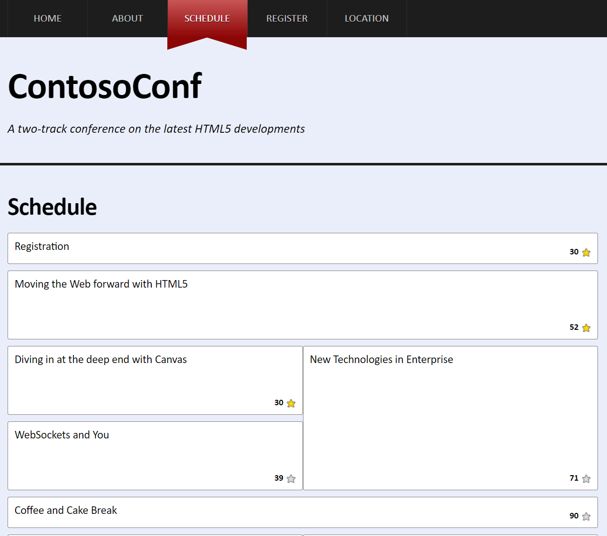

# Laboratorio Módulo 9: Adding Offline Support to Web Applications
## Exercise 2: Persisting User Data by Using the Local Storage API
### Nombres y apellidos:
Miguel Ángel Cabrero Luengo
### Fecha:
13/10/2020
### Resumen del Ejercicio:

#### Objetivo del ejercicio:
Validar que el navegador graba de forma local información que el usuario ha generado en el navegador.

#### Tareas realizadas:

En el fichero LocalStarStorage.js donde se encuentra el código jscript, se realizan los siguientes cambios:

- Se utiliza el objeto localStorage para almacenar y recuperar los cambios que se hagan sobre los elementos star de la página schedule.htm.

Resultados de ejecución:

#### Pantalla Schedule:

Las estrellas seleccionadas, cambian de color, de blanco a amarillo, al cerrarse el navegador y volverse a abrir deberían volver a tener color blanco. Al utilizar localstorage se almacena el valor cada vez que el usuario pulsa sobre una de las estrellas y al abrir el navegador se recupera el último valor que tuvieran (blanco o amarillo)

### Dificultad o problemas presentados y cómo se resolvieron:
No ha presentado problemas.

Puede probarse con los siguientes enlaces:

- Página <a href="schedule.htm" target="_blank">schedule</a>.